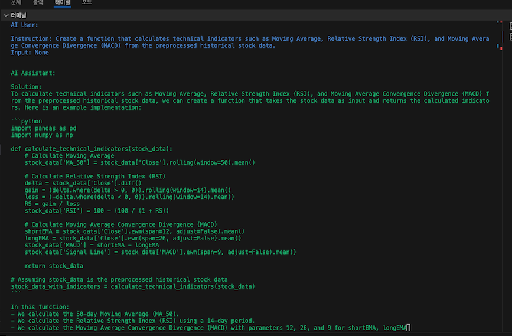
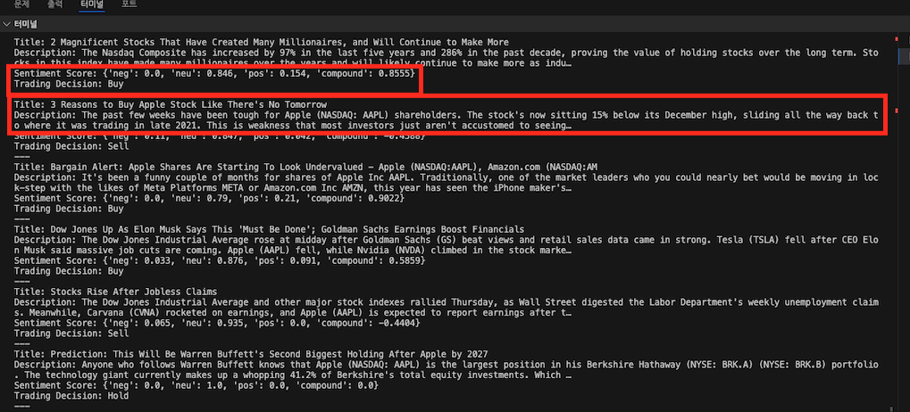

# Camel - Role Playing Session Report
## Objective : "Develop a trading bot for the stock market"
## Agent Role : Assistant (Python Programmer), User (Stock Trader)
## Model : GPT 3.5 turbo

---

# 1. INSIGHT
'''

    성능에 대한 검증은 확실치 않음. Title과 Description 부분 중 하나라도 None 값이면 에러 발생 (예외 처리가 안되어 있음)
    추가 개발로 거래 실행 & 시장 데이터 분석 & 성능 및 백테스팅 & 실시간 모니터링과 조정 등 실제 디테일 기능은 구현되어 있지 않음
  
    Objective(Input Task)를 두 에이전트가 단단한 구조의 코드까지는 구현(기사에서 감정에 따른 주식 거래 의사결정)
    단, 디테일한 구현과 후속 개발에 대한 내용은 없음
'''
---

# 2. Camel : Role Playing
## 두 명의 Agent 가 목표를 입력으로 받고 토론을 통해 "주식 거래 봇"을 개발하는 코드 작성

---

# 3. Result
## NewsAPI 에서의 article 를 기반으로 텍스트를 추출하고 텍스트로 감정 분석을 점수화 하여 주식 거래의 의사 결정을 내려주는 봇을 구현

