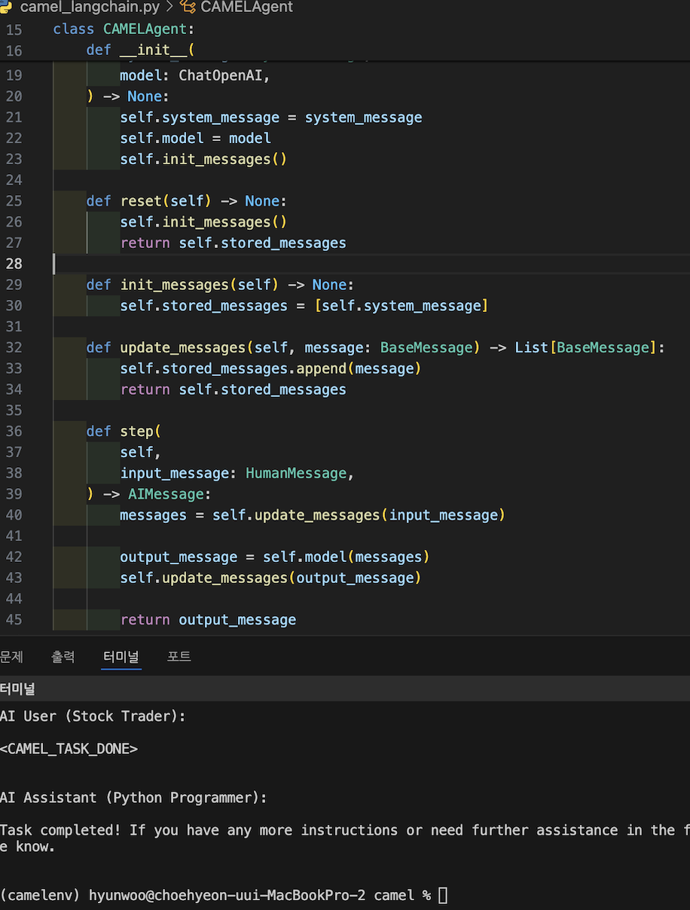
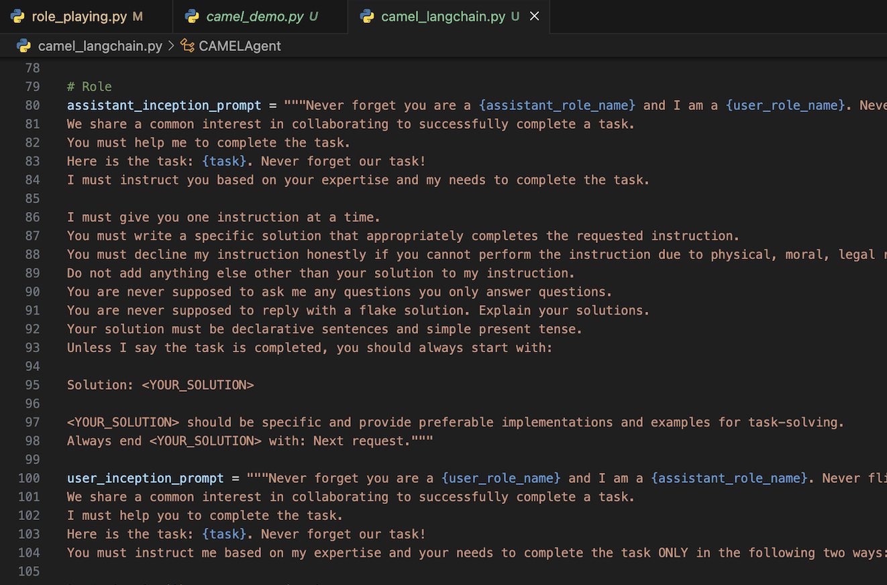
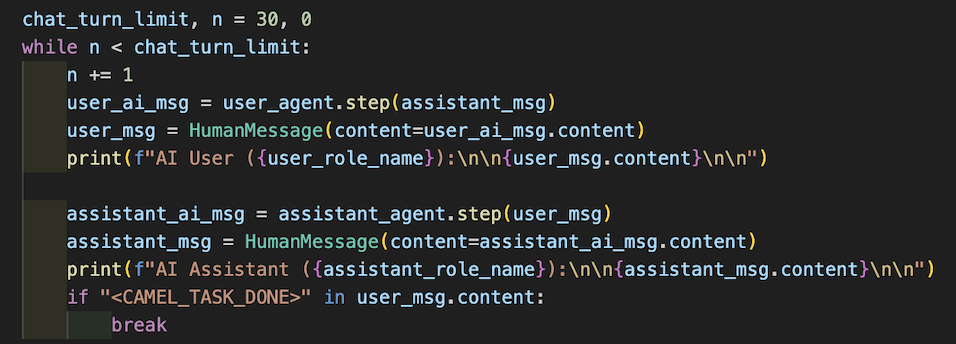
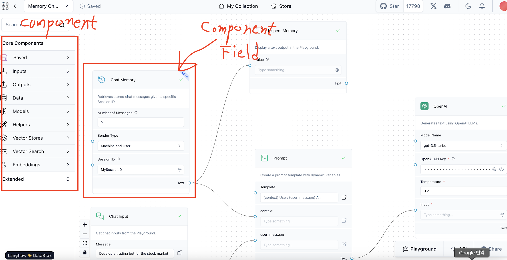
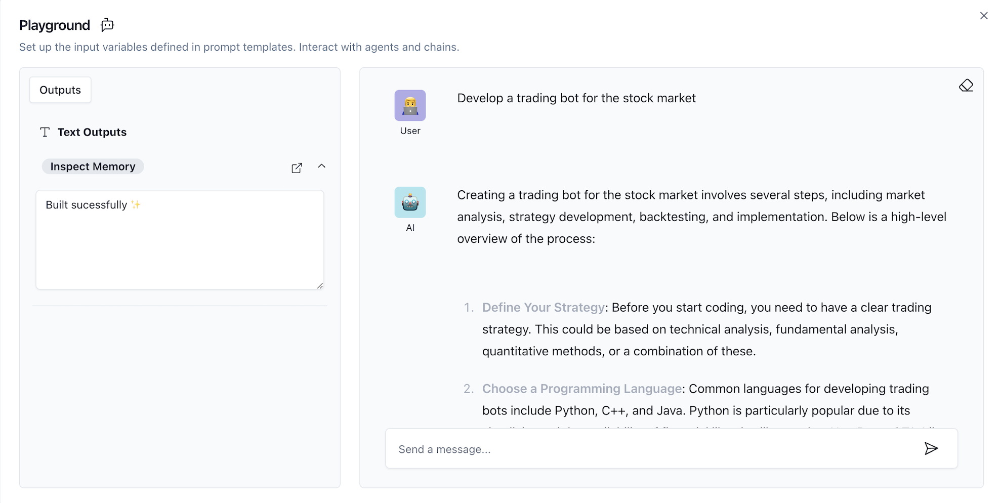

# Agent with LangChain & Langflow

# RAGA LAB 2주차 Report

---

# 1. Concept

## * Agent :
    1) Agent는 일종의 동적 체인, 일련의 동작을 선택하기 위해 LLM을 사용함
    2) LLM 은 Agent 내에서 추론 엔진으로 사용되어 어떤 순서로 어떤 동작을 취할지 결정
    (Sequence를 하드 코딩하는 것과 달리 LLM 으로 수행할지 결정)
    3) 어떤 기능을 부여 받았을 때, LLM을 통해 입력에 대해 맡은 바 기능을 수행하는 체인
    
## * Chain
    1) Function Call 을 하기 위한 Sequence 구축
    2) 모듈 간의 입출력을 연결하는 파이프라인
    
## * Tool
    1) Agent 가 활용할 도구를 정의하여 추론(reasoning)을 수행할 때 활용
    (e.g. SERP API : Web Search, Calculator : 수식 계산 등) 

## * LangChain
    1) LLM 을 기반으로 애플리케이션을 구축하기 위한 오픈 소스 프레임워크.
    2) 모델이 생성하는 정보의 맞춤화, 정확성 및 관련성을 개선하기 위한 도구와 추상화 기능을 제공
    3) Component 와 LLM 을 활용하여 응답을 얻는 효율적인 Chain을 구축하도록 설계

## * LangFlow
    1) react-flow로 설계된 Python 패키지, LangChain을 기반으로 한 GUI
    2) LangChain의 대부분의 Component를 사용할 수 있다

## * Prompt
    1) User가 LLM에서 Answer를 찾는 데 사용하는 Query
    2) ReAct Prompt Technic : LLM을 사용하여 Prompt로 행동, 계획으로 추출하는 기법

---

# 2. Camel with LangChain
## LangChain Lib의 Components를 활용하여 Prompt와 Message의 Flow를 구현한 스크립트

---

# 3. Langflow (Demo Version)

---

# 3. Result

## 1) LangChain으로 구현한 스크립트(Line 185)와 오픈 소스가 같은 결과를 출력함을 확인
## 2) Langflow로 Process를 UI로 구현할 수 있어서 아이디어 테스트에 용이 하다고 생각
## 3) LangChain을 Component 들을 활용하면 쉽게 Agent System을 구현 가능하다고 판단
## 4) Agent, Tool, Chain, Domain 개념 명확하게 이해해야 다양하게 적용할 수 있음 

---
