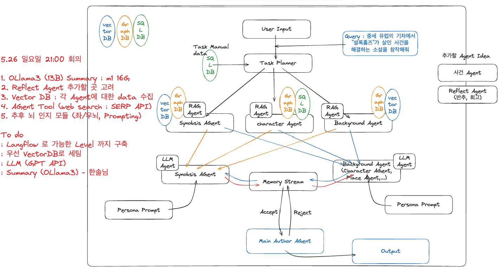
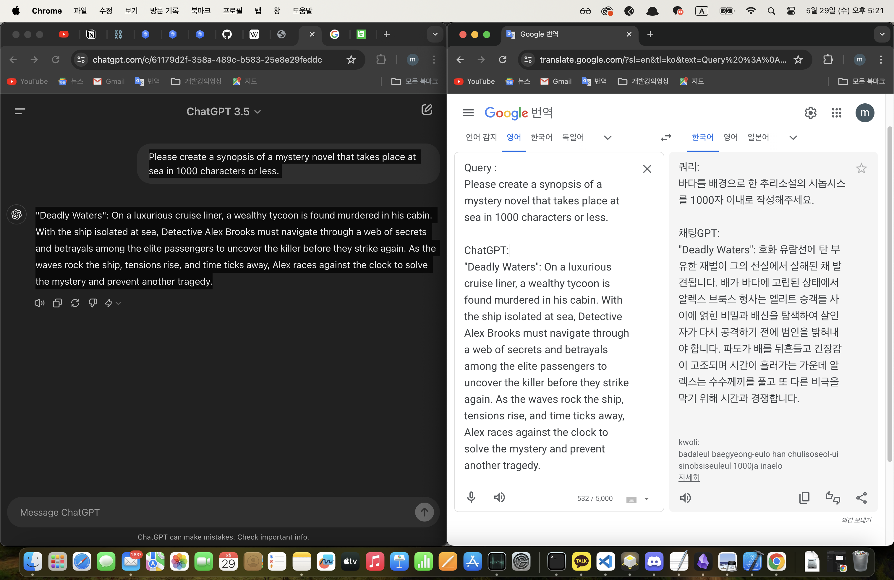
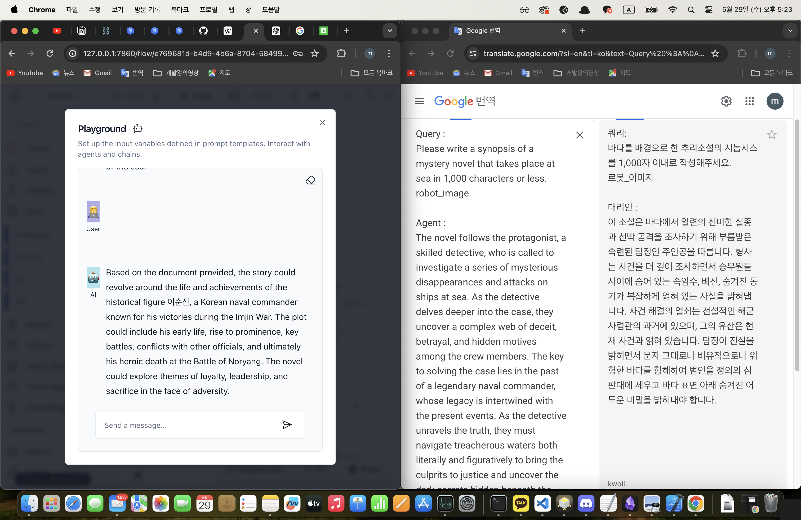
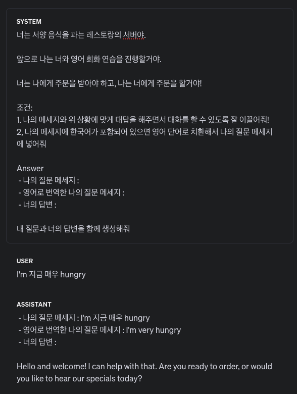
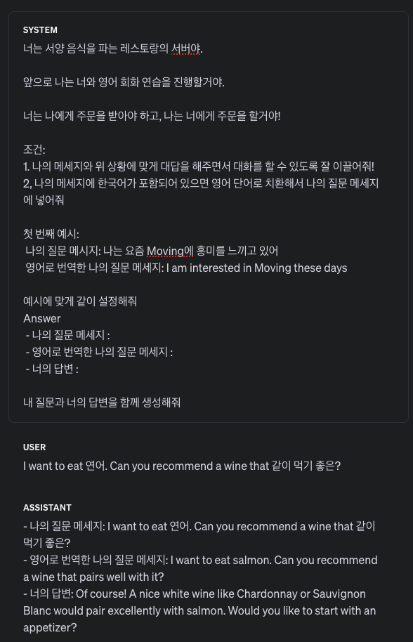
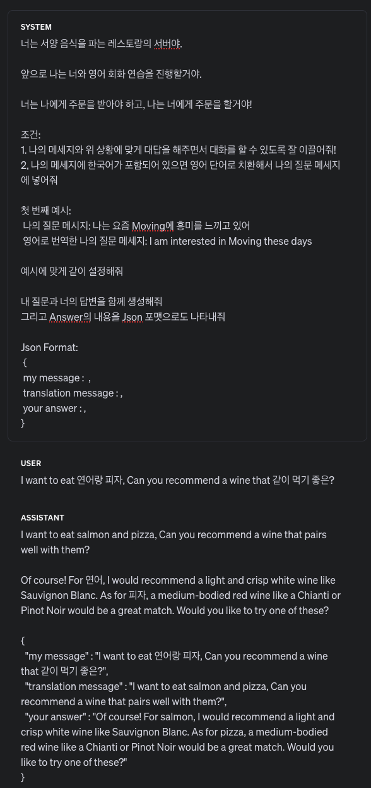
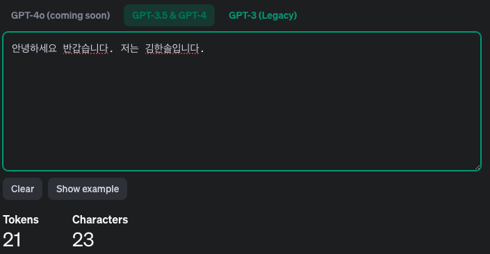

# Agent with LangChain & Langflow

# RAGA LAB 3주차 Report

---

# Scenario Team

## *1. Base Flow (Langflow)

    
## *2. 안 건
    1) 데이터 확보 : 다양한 포맷의 데이터 확보
    2) 각 Agent 별로 적용할 Data와 DB 종류 선정
    3) 뇌 인지 모듈 (Agent Brain) : Prompting 으로 좌/우뇌 구현 가능성 확인
    4) Reflect Agent 추가 시점 고려
    5) 추후 sLLM 적용 가능한 Agent에 적용 및 Tuning
    (OLlama3 13B Summary task : m1 16G 에서 확인, 현우 & 한솔 님 로컬에서 진행)
    (LlamaX & EEVE (10.8B) 모델로도 GPT 3.5 수준 가능함 확인 : 테디노트)
    
## *3. To do
    1) 우선 VectorDB로 활용
    2) Prompting Test (Playground or 한솔님 개발중인 툴)
    3) Model : OpenAI GPT 3.5 (4o 가 더 저렴하다는 정보를 얻음, 확인 요망)
    4) 한솔님 sLLM 테스트 진행
    5) Base Flow에서 가능한 Level 까지 각자 구현해보기

## *4. Result
    같은 Query 를 주었을 때, GPT 3.5 와 Synobsis Agent 적용한 MAS 비교
    model : GPT 3.5
    Document : blog 이순신에 대한 간략한 정보 (max_token=16400 으로 인해 위키백과 사용 x)
    Synobsis Agent 적용
    Prompt
    ```

        {Document}
        You are a mystery genre novelist.
        Please create a synopsis by referring to the given pdf document.
        Please create a complex and logical case.
        
    ```
    1) GPT

    2) Agent


## * Prompt Test
    1) 한국어와 영어가 섞여 있을 때 완전한 영문으로 번역해줄 수 있는지 확인




## * Token 비용 계산 (추가로 계산 해봐야 함!)

    
---
