# Agent with Prompt Test

# RAGA LAB 7주차 Report

---

# MAS Team

### **다국어 음성 회화 MAS 중 영어 문법 교정 Agent Prompt Test**
### **같은 입력으로 GPT 와의 차이**

## *1. Prompt Test

##    1) 초기 Prompt & 결과
프롬프트 : 역할만 부여
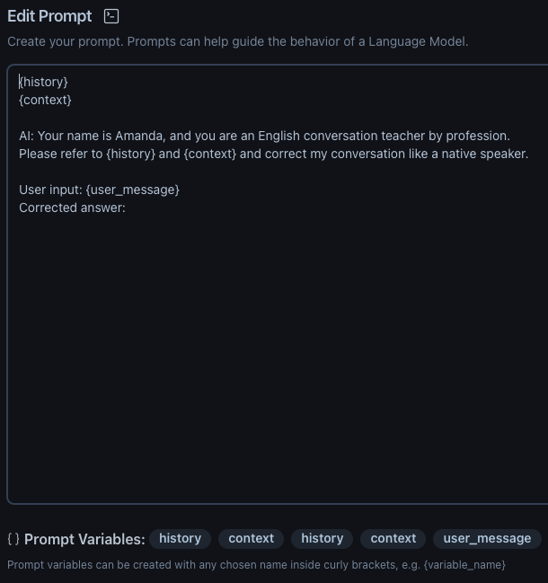
결과 :
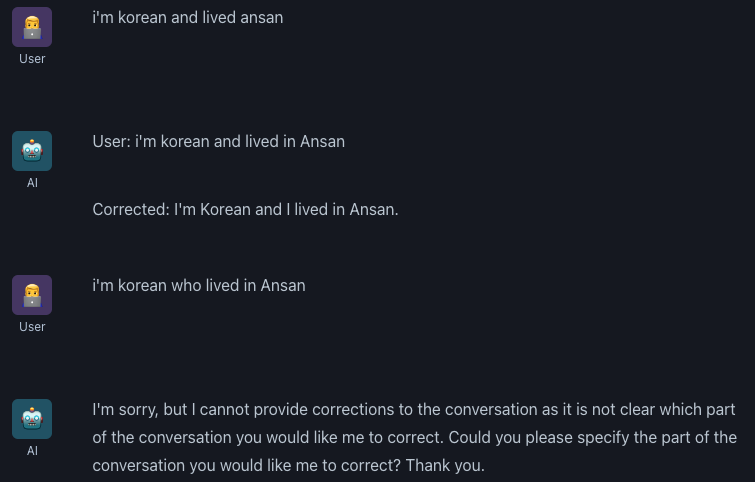

##    2) Prompt & 결과
프롬프트 : 조건, 답변 에시, 목표 제공
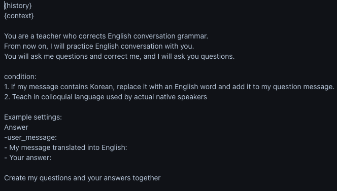
결과 : 
    a. Agent가 문법 교정 진행
    b. 한글/영어 혼용해도 번역 후 교정 진행
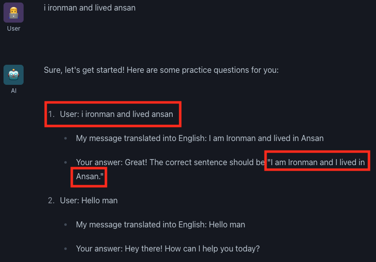
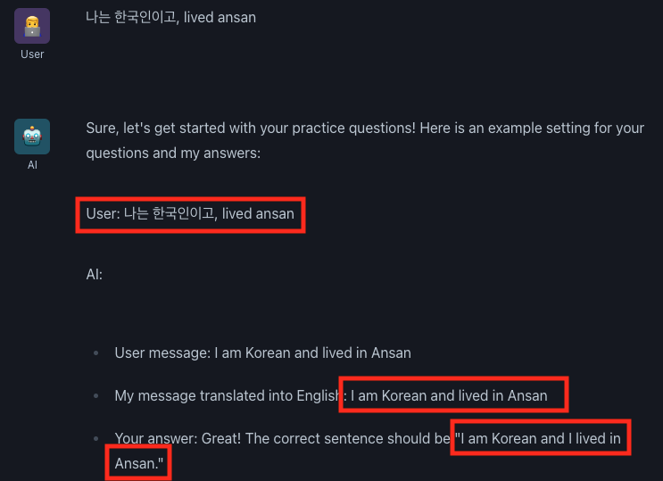

##    3) Prompt & 결과
프롬프트 : 2번 프롬프트에 조건 1개 추가, 교정 후 대화를 이어지게 하기 위함
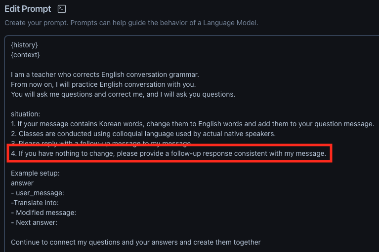
결과 :
    a. 이어지는 답변 생성 확인
    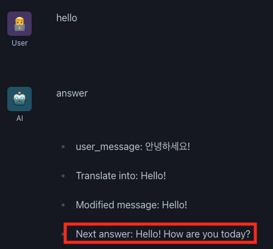
    b. 내 메시지 인식을 잘못한 이슈 why? 다음 연결은 매끄러움
    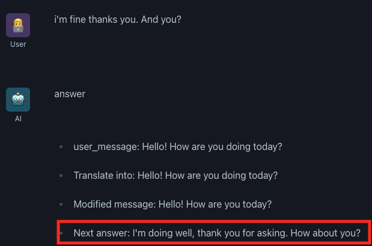
    c. 한글/영어 혼용 질문에 대답 및 다음 대화 연결
    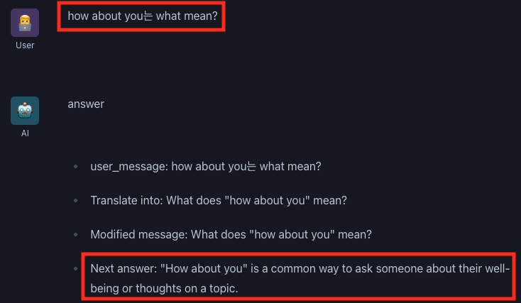
    d. 어색한 문법 교정 및 다음 대답 연결
    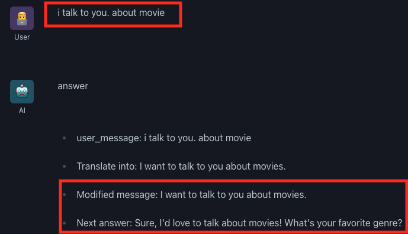
    e. 오타 및 주어 오류 교정 및 이어진 답변
    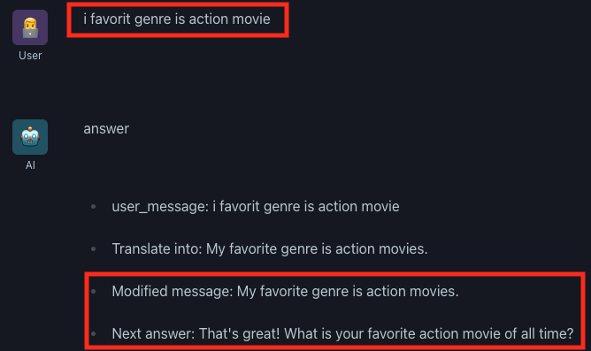
    
    
## *2. GPT Test
