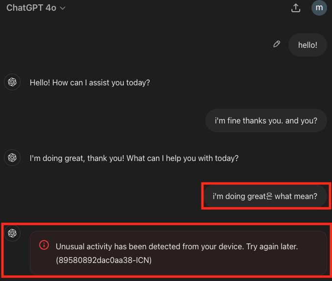

# RAGA LAB 7주차 Report
## Agent with Prompt Test

---

# MAS Team
---

### **다국어 음성 회화 MAS 중 영어 문법 교정 Agent Prompt Test**
### **같은 입력으로 GPT 와의 차이**

# 1. Prompt Test (Agent GPT 3.5 turbo)

##    1) 초기 Prompt & 결과
프롬프트 : 역할만 부여

결과 :

##    2) Prompt & 결과
프롬프트 : 조건, 답변 에시, 목표 제공

결과 : 
    a. Agent가 문법 교정 진행
    

    b. 한글/영어 혼용해도 번역 후 교정 진행 (**GPT는 여기서 인식 오류 발생** (GPT4o))
    

##    3) Prompt & 결과
프롬프트 : 2번 프롬프트에 조건 1개 추가, 교정 후 대화를 이어지게 하기 위함

결과 :
    a. 이어지는 답변 생성 확인
    

    
    b. 내 메시지 인식을 잘못한 이슈 why? 다음 연결은 매끄러움
    

    
    c. 한글/영어 혼용 질문에 대답 및 다음 대화 연결
    

    
    d. 어색한 문법 교정 및 다음 대답 연결
    

    
    e. 오타 및 주어 오류 교정 및 이어진 답변
    

    
    
## 2. GPT Test (GPT4o)

**먼저 GPT에게 영어 회화 선생님 Role 과 간단한 프롬프트만 주고 시작 했을 시 주제 선정부터 여러가지 조건 설정 필요**

**Agent와 같은 사용자 입력으로 진행**

결과 :

    a. 한글/영어 혼용해서 모르는 문장 질문 했더니 오류 발생, 10번 이상 시도해서 답변 성공 (답변도 생성하다 실패 반복)
    

    b. 틀린 문장 교정 없이 GPT가 유추해서 다음 답변 생성. 개인적으로 답변도 길고 너무 형식적이라 판단
    

