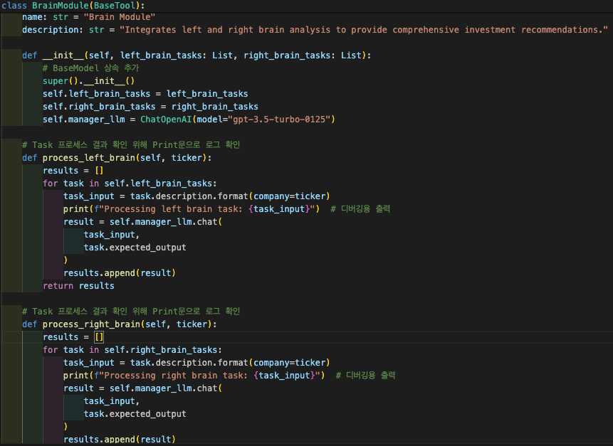
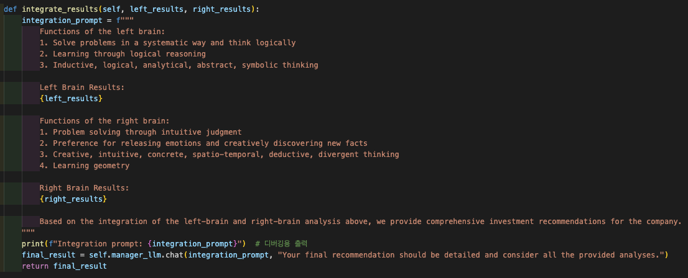
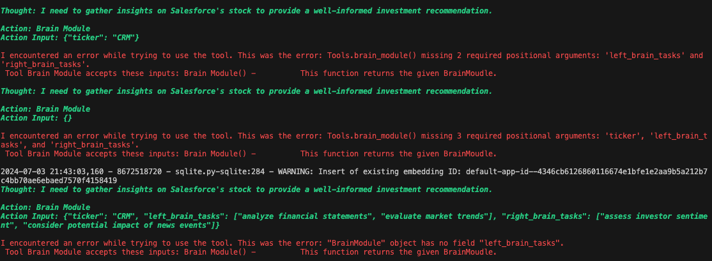
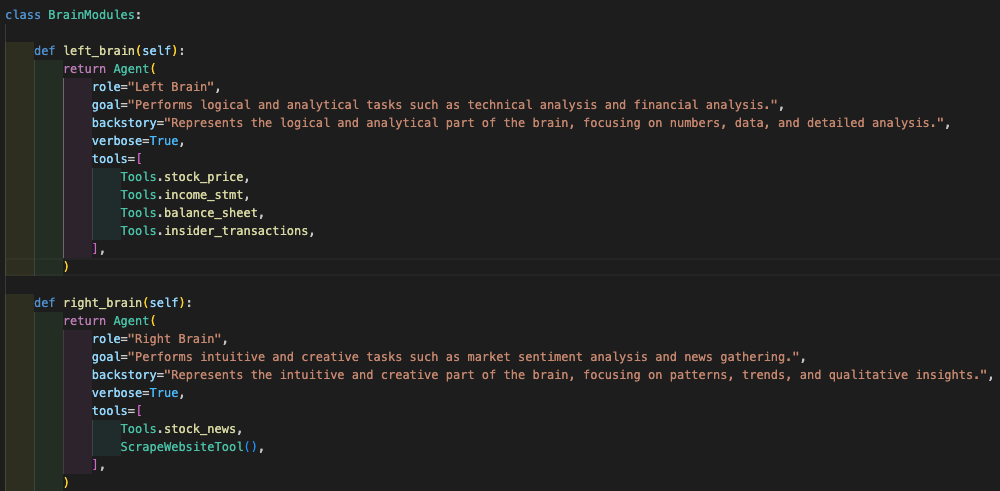
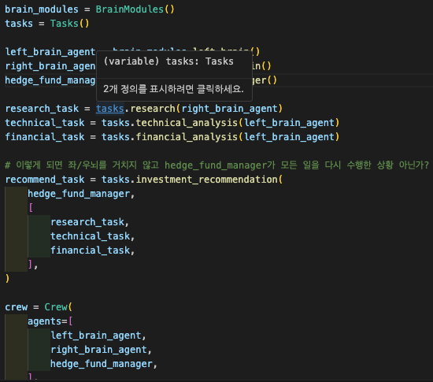
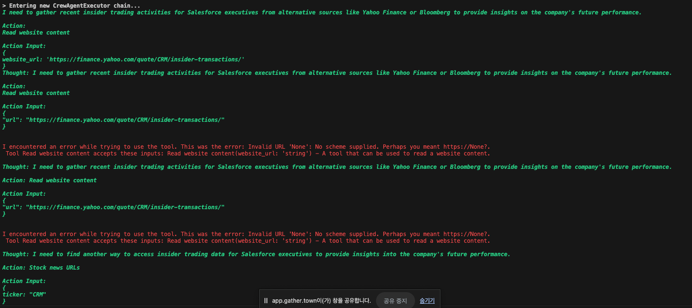
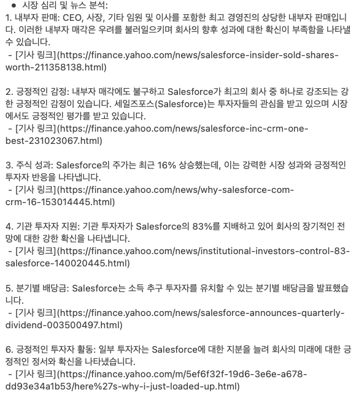
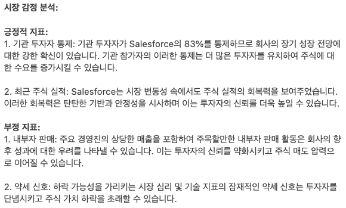

# RAGA LAB 8주차 Report
## 주식 종목 투자에 대한 의사결정 Multi Agent System
## 뇌 모듈 적용 (좌,우뇌 구조를 모방한 모듈)

---

## 1. Stock_Decision MAS

### 1) Agent

###   a. Researcher : Task research
###   b. Technical_analyst : Task technical_analysis
###   c. Financial_analyst : Task Financial_analysis
###   d. Hedge_fund_manager : Task investment_recommendation

---

### 2) Task

###   a. research : 최근 주요 뉴스 기사 URL 감정 분석 (시장 심리 등)
###   b. technical_analysis : 가격 변동에 대한 기술 분석
###      (추세, 향후 성과, 영향, 주요 지지/저항 수준, 차트패턴 및 기술지표, 진입점과 가격 목표에 대한 통찰)
###   c. financial_analysis : 재무 건전성과 실적 평가
###      (내부자 거래, 수익, 현금 흐름, 재무 지표에 대한 통찰, 주식의 가치 & 성장 잠재력 평가)
###   d. investment_recommendation : 위 Agent들에게 Task에 대한 보고서를 받아서 종합 분석 및
###      의사 결정 출력

---

### 3) Tool

###   a. stock_price
###   b. stock_news
###   c. incom_stmt
###   d. balance_sheet
###   e. insider_transaction

---

## 2. 뇌모듈 적용

### 1) 뇌 모듈 (class BrainModule)

### - tool로써 뇌 모듈 사용
### - 좌, 우뇌를 포함한 객체
### - Hedge_fund_manager Agent에게 tool로 부여
### - 적용 안됨을 확인, Task 별로 입력 인자가 안 맞아서 Tool로써 사용 안함
### **그래서 새로운 방식으로 뇌 모듈 적용 구상**

### [에러 이미지]
### - 입력 인자가 아나리 tool로 사용 안함

### 에러 로그 (에러 원인 & 해결)
### txt 파일로 저장되어 있음 후에 업데이트 예정

---

### 2) 뇌 모듈 (class BrainModule)

### - 좌, 우뇌를 각각 Agent로 구현
### - 좌, 우뇌에 맞는 Task 할당 (우뇌 : 뉴스 감정 분석)
### - 좌, 우뇌에 간단한 프롬프트만 부여함 (좌뇌 : 논리적 처리, 우뇌 : 직관적 처리)
### - 문제없이 작동하고, 뇌 모듈 적용 안했을 때와 비교하면 결과가 다름 (자세한 분석 필요)
---
### [개선 방향]
### **추후 좌,우뇌에게 Task를 어떻게 할당할 것인지 고려**
### **hedge_fund_manager에게 어떻게 적용 시켜줄 건지 구상할 예정**

---

### 에러 : Financial_analysis 보고서가 작성 안됨
### [다른 에러 로그]

---

## 3. 결과 비교
### 좌뇌에 할당한 Task와 기존(적용x)에 할당한 Task의 리포트와 종합적인 결과는 둘다 표현만 다르고 내용은 같음

### 1) 뇌 적용 X

## 전문가 분석처럼 자세하고 논리적으로 출력된다고 생각

---

### 2) 뇌 적용 O

## 링크 별로 분석한 내용들을 종합하여 긍/부정으로 분류하고 직관적으로 출력

